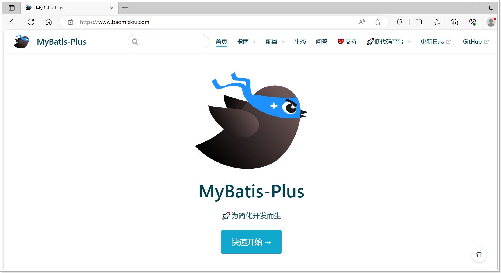
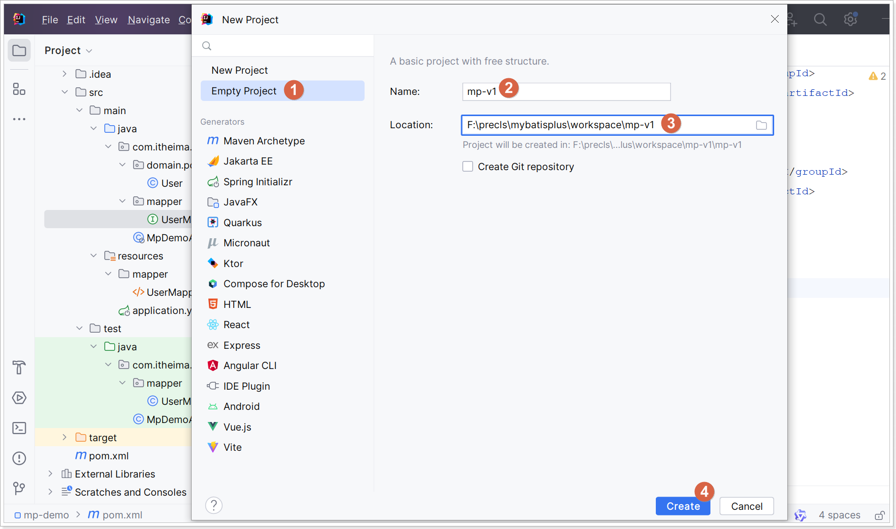
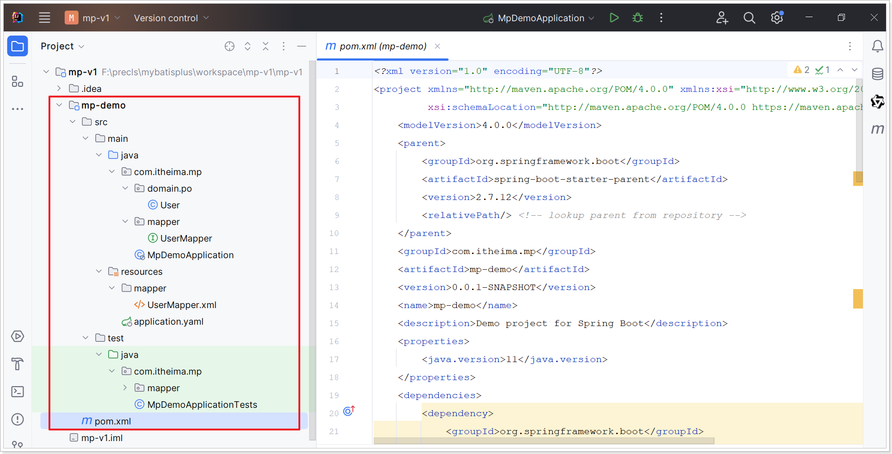
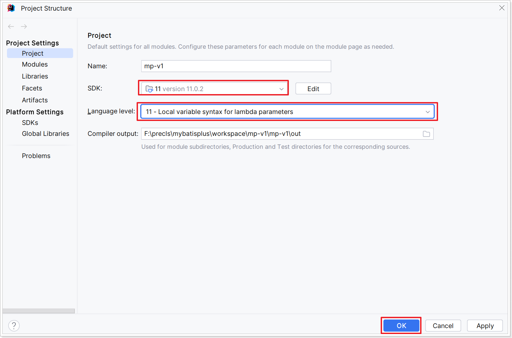
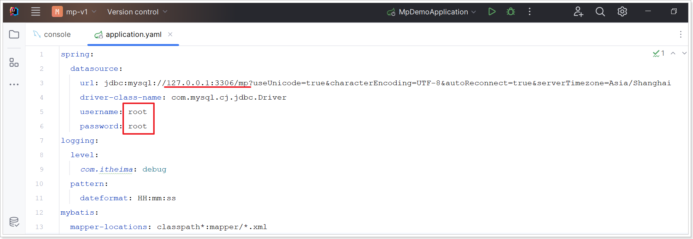
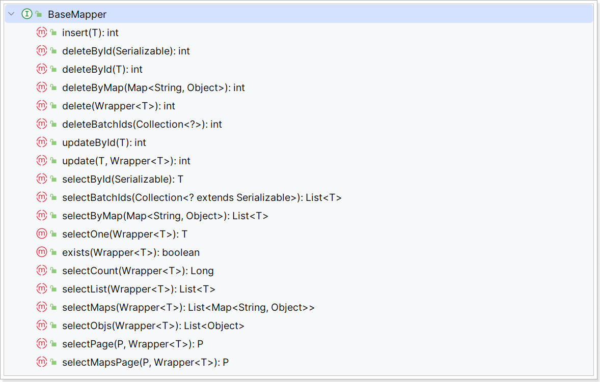

# MybatisPlus

大家在日常开发中应该能发现，单表的CRUD功能代码重复度很高，也没有什么难度。而这部分代码量往往比较大，开发起来比较费时。

因此，目前企业中都会使用一些组件来简化或省略单表的CRUD开发工作。目前在国内使用较多的一个组件就是MybatisPlus。[MyBatisPlus官网](https://www.baomidou.com/)



当然，MybatisPlus不仅仅可以简化单表操作，而且还对Mybatis的功能有很多的增强。可以让我们的开发更加的简单，高效。

通过今天的学习，我们要达成下面的目标：

- 能利用MybatisPlus实现基本的CRUD
- 会使用条件构造器构建查询和更新语句
- 会使用MybatisPlus中的常用注解
- 会使用MybatisPlus处理枚举、JSON类型字段
- 会使用MybatisPlus实现分页


# 1、快速入门

为了方便测试，我们先准备一个用于演示测试的项目，并准备一些基础数据。

## 1.1、环境准备

### 1.1.1、导入项目

使用IDEA创建一个空工程；





复制 `资料\mp-demo` 到刚刚创建的空工程下；（不要包含空格和特殊字符）。然后用IDEA工具导入打开，项目结构如下：





注意配置一下项目的JDK版本为JDK11。 `Ctrl + Alt + Shift + S`打开项目结构设置：




### 1.1.2、初始化数据

将 `资料\mp.sql` 文件使用 MySQL 图形界面工具导入并执行里面的数据库脚本；创建如下两张表：


### 1.1.3、修改数据库连接

在刚刚导入的工程中；找到 `application.yaml`文件；修改jdbc连接参数为自己数据库信息。



## 1.2、快速开始

比如我们要实现User表的CRUD，只需要下面几步：

- 引入MybatisPlus依赖
- 定义Mapper

### 1.2.1、引入依赖

MybatisPlus提供了starter，实现了自动Mybatis以及MybatisPlus的自动装配功能，坐标如下：

```xml
<dependency>
    <groupId>com.baomidou</groupId>
    <artifactId>mybatis-plus-boot-starter</artifactId>
    <version>3.5.3.2</version>
</dependency>
```

由于这个starter包含对mybatis的自动装配，因此完全可以替换掉Mybatis的starter。 最终，项目的依赖如下：

```xml
    <dependencies>
        <dependency>
            <groupId>com.baomidou</groupId>
            <artifactId>mybatis-plus-boot-starter</artifactId>
            <version>3.5.3.2</version>
        </dependency>
        <dependency>
            <groupId>com.mysql</groupId>
            <artifactId>mysql-connector-j</artifactId>
            <scope>runtime</scope>
        </dependency>
        <dependency>
            <groupId>org.projectlombok</groupId>
            <artifactId>lombok</artifactId>
            <optional>true</optional>
        </dependency>
        <dependency>
            <groupId>org.springframework.boot</groupId>
            <artifactId>spring-boot-starter-test</artifactId>
            <scope>test</scope>
        </dependency>

        <dependency>
            <groupId>cn.hutool</groupId>
            <artifactId>hutool-all</artifactId>
            <version>5.8.11</version>
        </dependency>
    </dependencies>
```


### 1.2.2、改造Mapper

为了简化单表CRUD，MybatisPlus提供了一个基础的`BaseMapper`接口，其中已经实现了单表的CRUD：



因此我们自定义的Mapper只要实现了这个`BaseMapper`，就无需自己实现单表CRUD了。 修改`mp-demo`中的`com.itheima.mp.mapper`包下的`UserMapper`接口，让其继承`BaseMapper`：


### 1.2.3、测试

删除 `UserMapper.xml`文件内容；并修改 `com.itheima.mp.mapper.UserMapperTest` 改造原有的方法都为 BaseMapper里面的方法来测试基本的CRUD方法。

```java
package com.itheima.mp.mapper;

import com.itheima.mp.domain.po.User;
import org.junit.jupiter.api.Test;
import org.springframework.beans.factory.annotation.Autowired;
import org.springframework.boot.test.context.SpringBootTest;

import java.time.LocalDateTime;
import java.util.List;

@SpringBootTest
class UserMapperTest {

    @Autowired
    private UserMapper userMapper;

    @Test
    void testInsert() {
        User user = new User();
        user.setId(5L);
        user.setUsername("Lucy");
        user.setPassword("123");
        user.setPhone("18688990011");
        user.setBalance(200);
        user.setInfo("{\"age\": 24, \"intro\": \"英文老师\", \"gender\": \"female\"}");
        user.setCreateTime(LocalDateTime.now());
        user.setUpdateTime(LocalDateTime.now());
        userMapper.insert(user);
    }

    @Test
    void testSelectById() {
        User user = userMapper.selectById(5L);
        System.out.println("user = " + user);
    }


    @Test
    void testQueryByIds() {
        List<User> users = userMapper.selectBatchIds(List.of(1L, 2L, 3L, 4L));
        users.forEach(System.out::println);
    }

    @Test
    void testUpdateById() {
        User user = new User();
        user.setId(5L);
        user.setBalance(20000);
        userMapper.updateById(user);
    }

    @Test
    void testDeleteUser() {
        userMapper.deleteById(5L);
    }
}
```


可以看到，在运行过程中打印出的SQL日志，非常标准：

```sql
15:36:59 DEBUG 3464 --- [           main] c.i.mp.mapper.UserMapper.selectById      : ==>  Preparing: SELECT id,username,password,phone,info,status,balance,create_time,update_time FROM user WHERE id=?
15:36:59 DEBUG 3464 --- [           main] c.i.mp.mapper.UserMapper.selectById      : ==> Parameters: 5(Long)
15:36:59 DEBUG 3464 --- [           main] c.i.mp.mapper.UserMapper.selectById      : <==      Total: 1
user = User(id=5, username=Lucy, password=123, phone=18688990011, info={"age": 24, "intro": "英文老师", "gender": "female"}, status=1, balance=200, createTime=2023-12-05T15:37, updateTime=2023-12-05T15:37)

```

只需要继承BaseMapper就能省去所有的单表CRUD，是不是非常简单！

## 1.3、常见注解

在刚刚的入门案例中，我们仅仅引入了依赖，继承了BaseMapper就能使用MybatisPlus，非常简单。但是问题来了： MybatisPlus如何知道我们要查询的是哪张表？表中有哪些字段呢？

大家回忆一下，UserMapper在继承BaseMapper的时候指定了一个泛型：


泛型中的User就是与数据库对应的PO.

MybatisPlus就是根据PO实体的信息来推断出表的信息，从而生成SQL的。默认情况下：

- MybatisPlus会把PO实体的类名驼峰转下划线作为表名
- MybatisPlus会把PO实体的所有变量名驼峰转下划线作为表的字段名，并根据变量类型推断字段类型
- MybatisPlus会把名为id的字段作为主键

但很多情况下，默认的实现与实际场景不符，因此MybatisPlus提供了一些注解便于我们声明表信息。

### 1.3.1、@TableName

**说明**：

> - 描述：表名注解，标识实体类对于的表
> - 使用位置：实体类类名上面

**示例**：

```java
@TableName("user")
public class User {
    private Long id;
    private String name;
}
```


**TableName**注解除了指定表名以外，还可以指定很多其它属性：

| **属性**         | **类型** | **必须指定** | **默认值** | **描述**                                                     |
| ---------------- | -------- | ------------ | ---------- | ------------------------------------------------------------ |
| value            | String   | 否           | ""         | 表名                                                         |
| schema           | String   | 否           | ""         | schema                                                       |
| keepGlobalPrefix | boolean  | 否           | false      | 是否保持使用全局的 tablePrefix 的值（当全局 tablePrefix 生效时） |
| resultMap        | String   | 否           | ""         | xml 中 resultMap 的 id（用于满足特定类型的实体类对象绑定）   |
| autoResultMap    | boolean  | 否           | false      | 是否自动构建 resultMap 并使用（如果设置 resultMap 则不会进行 resultMap 的自动构建与注入） |
| excludeProperty  | String[] | 否           | {}         | 需要排除的属性名 @since 3.3.1                                |

### 1.3.2、@TableId

**说明**：

> - 描述：主键注解；用于标记实体类中的主键字段
> - 使用位置：实体类中属性之上

**示例**：

```java
@TableName("user")
public class User {
    @TableId
    private Long id;
    private String name;
}
```

TableId 注解有两个属性：

| **属性** | **类型** | **必须指定** | **默认值**  | **描述**     |
| :------- | :------- | :----------- | :---------- | :----------- |
| value    | String   | 否           | ""          | 表名         |
| type     | Enum     | 否           | IdType.NONE | 指定主键类型 |


`IdType`支持的类型有如下：

| **值**            | **描述**                                                     |
| :---------------- | :----------------------------------------------------------- |
| AUTO              | 数据库 ID 自增                                               |
| NONE              | 无状态，该类型为未设置主键类型（注解里等于跟随全局，全局里约等于 INPUT） |
| INPUT             | insert 前自行 set 主键值                                     |
| ASSIGN_ID         | 分配 ID(主键类型为 Number(Long 和 Integer)或 String)(since 3.3.0),使用接口IdentifierGenerator的方法nextId(默认实现类为DefaultIdentifierGenerator雪花算法) |
| ASSIGN_UUID       | 分配 UUID,主键类型为 String(since 3.3.0),使用接口IdentifierGenerator的方法nextUUID(默认 default 方法) |
| ~~ID_WORKER~~     | 分布式全局唯一 ID 长整型类型(please use ASSIGN_ID)           |
| ~~UUID~~          | 32 位 UUID 字符串(please use ASSIGN_UUID)                    |
| ~~ID_WORKER_STR~~ | 分布式全局唯一 ID 字符串类型(please use ASSIGN_ID)           |

这里比较常见的有三种：

- `AUTO`：利用数据库的id自增长

- `INPUT`：手动生成id

- `ASSIGN_ID`：雪花算法生成`Long`类型的全局唯一id，这是默认的ID策略

  

### 1.3.3、@TableField

**说明**：

> - 描述：普通字段注解；标记属性是否是表中的字段及哪个字段；一般特殊的字段才需要这样标记。
> - 使用位置：实体类属性之上

**示例**：

```java
@TableName("user")
public class User {
    @TableId
    private Long id;
    private String name;
    private Integer age;
    @TableField("isMarried")
    private Boolean isMarried;
    @TableField("concat")
    private String concat;
}
```

一般情况下我们并不需要给字段添加`@TableField`注解，一些特殊情况除外：

- 成员变量名与数据库字段名不一致
- 成员变量是以`isXXX`命名，按照`JavaBean`的规范，`MybatisPlus`识别字段时会把`is`去除，这就导致与数据库不符。
- 成员变量名与数据库一致，但是与数据库的关键字冲突。使用`@TableField`注解给字段名添加 ` 转义

支持的其它属性如下：

| **属性**         | **类型**   | **必填** | **默认值**            | **描述**                                                     |
| ---------------- | ---------- | -------- | --------------------- | ------------------------------------------------------------ |
| value            | String     | 否       | ""                    | 数据库字段名                                                 |
| exist            | boolean    | 否       | true                  | 是否为数据库表字段                                           |
| condition        | String     | 否       | ""                    | 字段 where 实体查询比较条件，有值设置则按设置的值为准，没有则为默认全局的 %s=#{%s}，[参考(opens new window)](https://github.com/baomidou/mybatis-plus/blob/3.0/mybatis-plus-annotation/src/main/java/com/baomidou/mybatisplus/annotation/SqlCondition.java) |
| update           | String     | 否       | ""                    | 字段 update set 部分注入，例如：当在version字段上注解update="%s+1" 表示更新时会 set version=version+1 （该属性优先级高于 el 属性） |
| insertStrategy   | Enum       | 否       | FieldStrategy.DEFAULT | 举例：NOT_NULL insert into table_a(<if test="columnProperty != null">column</if>) values (<if test="columnProperty != null">#{columnProperty}</if>) |
| updateStrategy   | Enum       | 否       | FieldStrategy.DEFAULT | 举例：IGNORED update table_a set column=#{columnProperty}    |
| whereStrategy    | Enum       | 否       | FieldStrategy.DEFAULT | 举例：NOT_EMPTY where <if test="columnProperty != null and columnProperty!=''">column=#{columnProperty}</if> |
| fill             | Enum       | 否       | FieldFill.DEFAULT     | 字段自动填充策略                                             |
| select           | boolean    | 否       | true                  | 是否进行 select 查询                                         |
| keepGlobalFormat | boolean    | 否       | false                 | 是否保持使用全局的 format 进行处理                           |
| jdbcType         | JdbcType   | 否       | JdbcType.UNDEFINED    | JDBC 类型 (该默认值不代表会按照该值生效)                     |
| typeHandler      | TypeHander | 否       |                       | 类型处理器 (该默认值不代表会按照该值生效)                    |
| numericScale     | String     | 否       | ""                    | 指定小数点后保留的位数                                       |

## 1.4、常见配置

MybatisPlus也支持基于yaml文件的自定义配置，详见官方文档：[使用配置 | MyBatis-Plus ](https://www.baomidou.com/pages/56bac0/#基本配置)

大多数的配置都有默认值，因此我们都无需配置。但还有一些是没有默认值的，例如:

- 实体类的别名扫描包
- 全局id类型

```yml
mybatis-plus:
  type-aliases-package: com.itheima.mp.domain.po
  global-config:
    db-config:
      id-type: auto # 全局id类型为自增长
```

需要注意的是，MyBatisPlus也支持手写SQL的，而mapper文件的读取地址可以自己配置：

```YAML
mybatis-plus:
  mapper-locations: "classpath*:/mapper/**/*.xml" # Mapper.xml文件地址，当前这个是默认值。
```

可以看到默认值是`classpath*:/mapper/**/*.xml`，也就是说我们只要把mapper.xml文件放置这个目录下就一定会被加载。

在示例工程中可以将原有的映射文件配置项注释或删除，然后再添加mybatisPlus配置项如下：


# 2、核心功能

刚才的案例中都是以id为条件的简单CRUD，一些复杂条件的SQL语句就要用到一些更高级的功能了。

## 2.1、条件构造器

除了新增以外，修改、删除、查询的SQL语句都需要指定where条件。因此BaseMapper中提供的相关方法除了以`id`作为`where`条件以外，还支持更加复杂的`where`条件。


参数中的`Wrapper`就是条件构造的抽象类，其下有很多默认实现，继承关系如图：


`Wrapper`的子类`AbstractWrapper`提供了where中包含的所有条件构造方法：


而QueryWrapper在AbstractWrapper的基础上拓展了一个select方法，允许指定查询字段：


而UpdateWrapper在AbstractWrapper的基础上拓展了一个set方法，允许指定SQL中的SET部分：


接下来，我们就来看看如何利用`Wrapper`实现复杂查询。

### 2.1.1、QueryWrapper

无论是修改、删除、查询，都可以使用QueryWrapper来构建查询条件。接下来看一些例子：

1） **查询**：查询出名字中带`o`的，存款大于等于1000元的人（id,username,info,balance）。代码如下：

```java
package com.itheima.mp.mapper;

import com.baomidou.mybatisplus.core.conditions.query.QueryWrapper;
import com.itheima.mp.domain.po.User;
import org.junit.jupiter.api.Test;
import org.springframework.beans.factory.annotation.Autowired;
import org.springframework.boot.test.context.SpringBootTest;

import java.util.List;

@SpringBootTest
public class WrapperTest {

    @Autowired
    private UserMapper userMapper;

    /**
     * 查询出名字中带o的，存款大于等于1000元的人（id,username,info,balance）
     */
    @Test
    public void testQueryWrapper1() {
        //1、构造查询条件；构造 where username like 'o' and balance >= 1000
        QueryWrapper<User> queryWrapper = new QueryWrapper<>();
        queryWrapper.
                select("id", "username", "info", "balance")
               .like("username", "o")
               .ge("balance", 1000);
        //2、查询
        List<User> list = userMapper.selectList(queryWrapper);
        list.forEach(System.out::println);
    }
}

```

2）**更新**：更新用户名为jack的用户的余额为2000，代码如下：

```java
    /**
     * 更新用户名为jack的用户的余额为2000
     */
    @Test
    public void testUpdate() {
        //1、构造查询条件；构造 where username = 'jack'
        QueryWrapper<User> queryWrapper = new QueryWrapper<>();
        queryWrapper.eq("username", "jack");
        // user中非null的字段，会进行set操作
        User user = new User();
        user.setBalance(2000);

        //2、修改；只更新非空字段
        userMapper.update(user, queryWrapper);
    }

```


### 2.1.2、UpdateWrapper

基于BaseMapper中的update方法更新时只能直接赋值，对于一些复杂的需求就难以实现。 

**例如**：更新id为`1,2,4`的用户的余额，扣200，对应的SQL应该是：

```sql
UPDATE user SET balance = balance - 1 where id in(1,2,4)
```

SET的赋值结果是基于字段现有值的，这个时候就要利用 UpdateWrapper 中的setSql功能了：

```java
    /**
     * 更新id为1,2,4的用户的余额，扣200
     */
    @Test
    public void testUpdateWrapper(){
        //1、构造更新条件对象
        UpdateWrapper<User> updateWrapper = new UpdateWrapper<>();
        // set balance = balance - 200
        updateWrapper.setSql("balance = balance - 200");
        // where id in (1,2,4)
        updateWrapper.in("id", 1, 2, 4);
        //2、更新
        userMapper.update(null, updateWrapper);
    }

```

### 2.1.3、LambdaQueryWrapper

无论是QueryWrapper还是UpdateWrapper在构造条件的时候都需要写死字段名称，会出现字符串`魔法值`。这在编程规范中显然是不推荐的。 那怎么样才能不写字段名，又能知道字段名呢？

其中一种办法是基于变量的`gettter`方法结合反射技术。因此我们只要将条件对应的字段的`getter`方法传递给MybatisPlus，它就能计算出对应的变量名了。而传递方法可以使用JDK8中的`方法引用`和`Lambda`表达式。 因此MybatisPlus又提供了一套基于Lambda的Wrapper，包含两个：

- LambdaQueryWrapper
- LambdaUpdateWrapper

分别对应QueryWrapper和UpdateWrapper

其使用方式如下：同样的查询需求：查询出名字中带o的，存款大于等于1000元的人（id,username,info,balance）

```java
    /**
     * 查询出名字中带o的，存款大于等于1000元的人（id,username,info,balance）
     */
    @Test
    public void testLambdaQueryWrapper() {
        //1、构造查询条件；构造 where username like 'o' and balance >= 1000
        LambdaQueryWrapper<User> queryWrapper = new LambdaQueryWrapper<>();
        queryWrapper.
                select(User::getId, User::getUsername, User::getInfo, User::getBalance)
                .like(User::getUsername, "o")
                .ge(User::getBalance, 1000);
        //2、查询
        List<User> list = userMapper.selectList(queryWrapper);
        list.forEach(System.out::println);
    }

```

## 2.2、自定义拼接SQL

在演示UpdateWrapper的案例中，我们在代码中编写了更新的SQL语句：


这种写法在某些企业也是不允许的，因为SQL语句最好都维护在持久层，而不是业务层。就当前案例来说，由于条件是in语句，只能将SQL写在Mapper.xml文件，利用foreach来生成动态SQL。 这实在是太麻烦了。假如查询条件更复杂，动态SQL的编写也会更加复杂。

所以，MybatisPlus提供了自定义SQL功能，可以让我们利用Wrapper生成查询条件，再结合Mapper.xml拼接SQL。


以当前案例来说，我们可以这样写：

```java
    /**
     * 更新id为1,2,4的用户的余额，扣200
     */
    @Test
    public void testCustomWrapper(){
        //1、构造更新条件对象
        QueryWrapper<User> queryWrapper = new QueryWrapper<>();
        queryWrapper.in("id", 1, 2, 4);

        //2、更新; 调用自定义的更新方法，传入更新数值与查询条件对象
        userMapper.updateBalanceByWrapper(200, queryWrapper);
    }

```

在 `UserMapper` 中添加如下方法：

```java
    @Update("UPDATE user SET balance = balance - #{amount} ${ew.customSqlSegment}")
    void updateBalanceByWrapper(@Param("amount") int amount, @Param("ew") QueryWrapper<User> queryWrapper);

```

> 注意：上述的执行语句中 ew 及 customSqlSegment 都不能修改；
>
> 1、queryWrapper 查询条件对象相当于对要执行的语句进行了语句的拼接
>
> 2、${ew.customSqlSegment} 可以使用在注解中，也可以使用在 Mapper.xml文件中进行SQL语句的拼接

## 2.3、Service接口

MybatisPlus不仅提供了BaseMapper，还提供了通用的Service接口及默认实现，封装了一些常用的service模板方法。 通用接口为`IService`，默认实现为`ServiceImpl`，其中封装的方法可以分为以下几类：

- `save`：新增
- `remove`：删除
- `update`：更新
- `get`：查询单个结果
- `list`：查询集合结果
- `count`：计数
- `page`：分页查询

### 2.3.1、基本方法说明

**新增**：


- `save`是新增单个元素
- `saveBatch`是批量新增
- `saveOrUpdate`是根据id判断，如果数据存在就更新，不存在则新增
- `saveOrUpdateBatch`是批量的新增或修改

**删除**：


- `removeById`：根据id删除

- `removeByIds`：根据id批量删除

- `removeByMap`：根据Map中的键值对为条件删除

- `remove(Wrapper)`：根据Wrapper条件删除

  

**修改**：


- `updateById`：根据id修改
- `update(Wrapper)`：根据`UpdateWrapper`修改，`Wrapper`中包含`set`和`where`部分
- `update(T，Wrapper)`：按照`T`内的数据修改与`Wrapper`匹配到的数据
- `updateBatchById`：根据id批量修改

**Get**：


- `getById`：根据id查询1条数据
- `getOne(Wrapper)`：根据`Wrapper`查询1条数据
- `getBaseMapper`：获取`Service`内的`BaseMapper`实现，某些时候需要直接调用`Mapper`内的自定义`SQL`时可以用这个方法获取到`Mapper`

**List**：


- `listByIds`：根据id批量查询
- `list(Wrapper)`：根据Wrapper条件查询多条数据
- `list()`：查询所有

**Count**：


- `count()`：统计所有数量
- `count(Wrapper)`：统计符合`Wrapper`条件的数据数量

**getBaseMapper**：

当我们在service中要调用Mapper中自定义SQL时，就必须获取service对应的Mapper，就可以通过这个方法：


### 2.3.2、基本用法

由于`Service`中经常需要定义与业务有关的自定义方法，因此我们不能直接使用`IService`，而是自定义`Service`接口，然后继承`IService`以拓展方法。同时，让自定义的`Service实现类`继承`ServiceImpl`，这样就不用自己实现`IService`中的接口了。

首先，定义`IUserService`，继承`IService`：

```java
package com.itheima.mp.service;

import com.baomidou.mybatisplus.extension.service.IService;
import com.itheima.mp.domain.po.User;

public interface IUserService extends IService<User> {
}

```

然后，编写`UserServiceImpl`类，继承`ServiceImpl`，实现`IUserService`：

```java
package com.itheima.mp.service.impl;

import com.baomidou.mybatisplus.extension.service.impl.ServiceImpl;
import com.itheima.mp.domain.po.User;
import com.itheima.mp.mapper.UserMapper;
import com.itheima.mp.service.IUserService;
import org.springframework.stereotype.Service;

@Service
public class UserServiceImpl extends ServiceImpl<UserMapper, User> implements IUserService {
}

```

项目结构如下：


### 2.3.3、案例

接下来，我们快速实现下面4个接口：

| **编号** | **接口**       | **请求方式** | **请求路径** | **请求参数** | **返回值** |
| :------- | :------------- | :----------- | :----------- | :----------- | :--------- |
| 1        | 新增用户       | POST         | /user        | 用户表单实体 | 无         |
| 2        | 删除用户       | DELETE       | /user/{id}   | 用户id       | 无         |
| 3        | 根据id查询用户 | GET          | /user/{id}   | 用户id       | 用户VO     |
| 4        | 根据id批量查询 | GET          | /user        | 用户id集合   | 用户VO集合 |

#### 1）配置

首先，希望可以在图形界面中方便测试案例中的接口的话；可以引入knife4j。我们在项目中引入几个依赖：

```xml
        <!--swagger-->
        <dependency>
            <groupId>com.github.xiaoymin</groupId>
            <artifactId>knife4j-openapi2-spring-boot-starter</artifactId>
            <version>4.1.0</version>
        </dependency>
        <!--web-->
        <dependency>
            <groupId>org.springframework.boot</groupId>
            <artifactId>spring-boot-starter-web</artifactId>
        </dependency>

```

然后需要在  `application.yaml` 配置swagger信息如下：

```yaml
knife4j:
  enable: true
  openapi:
    title: 用户管理接口文档
    description: 用户管理接口文档
    version: 1.0
    concat: 黑马
    url: http://www.itheima.com
    email: itcast@itheima.com
    group:
      default:
        group-name: default
        api-rule: package
        api-rule-resources:
          - com.itheima.mp.controller

```


#### 2）DTO与VO

然后，接口需要两个实体：

- UserFormDTO：代表新增时的用户表单
- UserVO：代表查询的返回结果

将 `资料\domain\dto\UserFormDTO.java` 复制到 `com.itheima.mp.domain.dto`

将 `资料\domain\vo\UserVO.java` 复制到 `com.itheima.mp.domain.vo`


#### 3）UserController

按照Restful风格编写UserController接口方法：

```java
package com.itheima.mp.controller;

import cn.hutool.core.bean.BeanUtil;
import com.itheima.mp.domain.dto.UserFormDTO;
import com.itheima.mp.domain.po.User;
import com.itheima.mp.domain.vo.UserVO;
import com.itheima.mp.service.IUserService;
import io.swagger.annotations.Api;
import io.swagger.annotations.ApiOperation;
import lombok.RequiredArgsConstructor;
import org.springframework.web.bind.annotation.*;

import java.util.List;

@Api(tags = "用户管理接口")
@RestController
@RequestMapping("/user")
@RequiredArgsConstructor
public class UserController {

    private final IUserService userService;

    /**
     * 新增用户
     * @param userFormDTO 用户表单实体
     */
    @ApiOperation("新增用户")
    @PostMapping
    public void save(@RequestBody UserFormDTO userFormDTO) {
        User user = BeanUtil.copyProperties(userFormDTO, User.class);
        userService.save(user);
    }

    /**
     * 删除用户
     * @param id 用户id
     */
    @ApiOperation("删除用户")
    @DeleteMapping("/{id}")
    public void delete(@PathVariable("id") Long id) {
        userService.removeById(id);
    }

    /**
     * 根据用户id查询用户
     * @param id 用户id
     */
    @ApiOperation("根据用户id查询用户")
    @GetMapping("/{id}")
    public UserVO queryById(@PathVariable("id") Long id) {
        User user = userService.getById(id);
        return BeanUtil.copyProperties(user, UserVO.class);
    }

    /**
     * 根据用户id集合查询用户
     * @param ids 用户id集合
     */
    @ApiOperation("根据用户id集合查询用户")
    @GetMapping
    public List<UserVO> queryByIds(@RequestParam("ids") List<Long> ids) {
        List<User> userList = userService.listByIds(ids);
        return BeanUtil.copyToList(userList, UserVO.class);
    }
}

```

可以看到上述接口都直接在controller即可实现，无需编写任何service代码，非常方便。启动项目之后，访问 http://localhost:8080/doc.html 进行接口测试验证。


### 2.3.4、案例扩展

不过，一些带有业务逻辑的接口则需要在service中自定义实现了。例如下面的需求：

- *根据用户id扣减用户余额*

这看起来是个简单修改功能，只要修改用户余额即可。但这个业务包含一些业务逻辑处理：

- *判断用户状态是否正常*
- *判断用户余额是否充足*

这些业务逻辑都要在service层来做，另外更新余额需要自定义SQL，要在mapper中来实现。因此，我们除了要编写controller以外，具体的业务还要在service和mapper中编写。

#### 1）UserController

在 `UserController` 新增如下方法：

```java
    /**
     * 根据用户Id、金额扣减用户的余额
     * @param id 用户id
     * @param amount 金额
     */
    @ApiOperation("根据用户Id、金额扣减用户的余额")
    @PutMapping("/{id}/deduction/{amount}")
    public void updateBalanceById(@PathVariable("id") Long id, @PathVariable("amount") Integer amount) {
        userService.deductBalance(id, amount);
    }

```


#### 2）IUserService

在 `IUserService` 新增如下方法：

```java
package com.itheima.mp.service;

import com.baomidou.mybatisplus.extension.service.IService;
import com.itheima.mp.domain.po.User;

public interface IUserService extends IService<User> {
    /**
     * 根据用户Id、金额扣减用户的余额
     * @param id 用户id
     * @param amount 金额
     */
    void deductBalance(Long id, Integer amount);
}

```


#### 3）UserServiceImpl

在 `UserServiceImpl`中实现方法如下：

```java
package com.itheima.mp.service.impl;

import com.baomidou.mybatisplus.extension.service.impl.ServiceImpl;
import com.itheima.mp.domain.po.User;
import com.itheima.mp.mapper.UserMapper;
import com.itheima.mp.service.IUserService;
import org.springframework.stereotype.Service;

@Service
public class UserServiceImpl extends ServiceImpl<UserMapper, User> implements IUserService {
    @Override
    public void deductBalance(Long id, Integer amount) {
        //1、查询用户
        User user = this.getById(id);
        //2、判断状态
        if (user == null || user.getStatus() == 2) {
            throw new RuntimeException("用户状态异常");
        }
        //3、判断余额
        if (user.getBalance() < amount) {
            throw new RuntimeException("用户余额不足");
        }
        //4、扣减余额
        baseMapper.deductBalance(id, amount);
    }
}

```

#### 4）UserMapper

在 `UserMapper`中添加如下方法：

```java
    @Update("UPDATE user SET balance = balance - #{amount} WHERE id=#{id}")
    void deductBalance(@Param("id") Long id, @Param("amount") Integer amount);

```

### 2.3.5、Lambda查询

IService中还提供了Lambda功能来简化我们的复杂查询及更新功能。我们通过两个案例来学习一下。

**案例一查询**：实现一个根据复杂条件查询用户的接口，查询条件如下：

- name：用户名关键字，可以为空
- status：用户状态，可以为空
- minBalance：最小余额，可以为空
- maxBalance：最大余额，可以为空

可以理解成一个用户的后台管理界面，管理员可以自己选择条件来筛选用户，因此上述条件不一定存在，需要做判断。

#### 1）引入UserQuery

我们首先需要定义一个查询条件实体，UserQuery实体。 将 `资料\domain\query\UserQuery` 放到项目的 `com.itheima.mp.domain.query` 包路径下。


#### 2）新增Controller方法

在 `UserController`中新增如下查询方法：

```java
    /**
     * 根据查询条件userQuery 查询用户列表
     * @param userQuery 查询条件
     * @return 用户列表
     */
    @ApiOperation("根据查询条件userQuery 查询用户列表")
    @PostMapping("/list")
    public List<UserVO> queryList(@RequestBody UserQuery userQuery) {
        String userName = userQuery.getName();
        Integer status = userQuery.getStatus();
        Integer minBalance = userQuery.getMinBalance();
        Integer maxBalance = userQuery.getMaxBalance();
        LambdaQueryWrapper<User> queryWrapper = new QueryWrapper<User>().lambda()
                .like(StrUtil.isNotBlank(userName), User::getUsername, userName)
                .eq(status != null, User::getStatus, status)
                .ge(minBalance != null, User::getBalance, minBalance)
                .le(maxBalance != null, User::getBalance, maxBalance);

        List<User> userList = userService.list(queryWrapper);
        return BeanUtil.copyToList(userList, UserVO.class);
    }

```

在组织查询条件的时候，我们加入了 `status != null` 这样的参数，意思就是当条件成立时才会添加这个查询条件，类似Mybatis的mapper.xml文件中的`if`标签。这样就实现了动态查询条件效果了。


#### 3）改进Controller方法

不过，上述条件构建的代码太麻烦了。 因此Service中对`LambdaQueryWrapper`和`LambdaUpdateWrapper`的用法进一步做了简化。我们无需自己通过`new`的方式来创建`Wrapper`，而是直接调用`lambdaQuery`和`lambdaUpdate`方法：

基于Service中的Lambda查询；改造上述的方法为如下：

```java
    /**
     * 根据查询条件userQuery 查询用户列表
     * @param userQuery 查询条件
     * @return 用户列表
     */
    @ApiOperation("根据查询条件userQuery 查询用户列表")
    @PostMapping("/list")
    public List<UserVO> queryList(@RequestBody UserQuery userQuery) {
        String userName = userQuery.getName();
        Integer status = userQuery.getStatus();
        Integer minBalance = userQuery.getMinBalance();
        Integer maxBalance = userQuery.getMaxBalance();
        /*LambdaQueryWrapper<User> queryWrapper = new QueryWrapper<User>().lambda()
                .like(StrUtil.isNotBlank(userName), User::getUsername, userName)
                .eq(status != null, User::getStatus, status)
                .ge(minBalance != null, User::getBalance, minBalance)
                .le(maxBalance != null, User::getBalance, maxBalance);

        List<User> userList = userService.list(queryWrapper);*/
        //改造为service中的lambdaQuery()
        List<User> userList = userService.lambdaQuery()
                .like(StrUtil.isNotBlank(userName), User::getUsername, userName)
                .eq(status != null, User::getStatus, status)
                .ge(minBalance != null, User::getBalance, minBalance)
                .le(maxBalance != null, User::getBalance, maxBalance)
                .list();
        return BeanUtil.copyToList(userList, UserVO.class);
    }

```

可以发现lambdaQuery方法中除了可以构建条件，还需要在链式编程的最后添加一个`list()`，这是在告诉MP我们的调用结果需要是一个list集合。这里不仅可以用`list()`，可选的方法有：

- `.one()`：最多1个结果
- `.list()`：返回集合结果
- `.count()`：返回计数结果

MybatisPlus会根据链式编程的最后一个方法来判断最终的返回结果。

### 2.3.6、Lambda更新

与lambdaQuery方法类似，IService中的lambdaUpdate方法可以非常方便的实现复杂更新业务。

例如下面的需求：

> **需求**：改造 UserServiceImpl 中原 根据id修改用户余额的接口，要求如下
>
> - 完成对用户状态校验
> - 完成对用户余额校验
> - 如果扣减后余额为0，则将用户status修改为冻结状态（2）

也就是说我们在扣减用户余额时，需要对用户剩余余额做出判断，

如果发现剩余余额为0，则应该将status修改为2，这就是说update语句的set部分是动态的。


修改 `UserServiceImpl` 中方法如下：

```java
    @Override
    public void deductBalance(Long id, Integer amount) {
        //1、查询用户
        User user = this.getById(id);
        //2、判断状态
        if (user == null || user.getStatus() == 2) {
            throw new RuntimeException("用户状态异常");
        }
        //3、判断余额
        if (user.getBalance() < amount) {
            throw new RuntimeException("用户余额不足");
        }
        //4、扣减余额
        //baseMapper.deductBalance(id, amount);
        int remainBalance = user.getBalance() - amount;
        this.lambdaUpdate()
                .set(User::getBalance, remainBalance) //更新余额
                .set(remainBalance == 0, User::getStatus, 2) //动态判断，是否更新status
                .eq(User::getId, id)
                .eq(User::getBalance, user.getBalance()) // 乐观锁
                .update();
    }
```


### 2.3.7、批量新增

IService中的批量新增功能使用起来非常方便，但有一点注意事项，我们先来测试一下。 首先我们测试逐条插入数据。创建 `mp-demo\src\test\java\com\itheima\mp\service\UserServiceTest.java` 如下：

```java
package com.itheima.mp.service;

import com.itheima.mp.domain.po.User;
import org.junit.jupiter.api.Test;
import org.springframework.beans.factory.annotation.Autowired;
import org.springframework.boot.test.context.SpringBootTest;

import java.time.LocalDateTime;

@SpringBootTest
public class UserServiceTest {

    @Autowired
    private IUserService userService;

    //逐条插入
    @Test
    public void testSaveOneByOne() {
        long begin = System.currentTimeMillis();
        for (int i = 1; i <= 10000; i++) {
            userService.save(buildUser(i));
        }
        long end = System.currentTimeMillis();
        System.out.println("耗时：" + (end - begin) + "ms");
    }

    private User buildUser(int i) {
        User user = new User();
        user.setUsername("user_"+i);
        user.setPassword("123");
        user.setPhone("18688990011");
        user.setBalance(200);
        user.setInfo("{\"age\": 24, \"intro\": \"英文老师\", \"gender\": \"female\"}");
        user.setCreateTime(LocalDateTime.now());
        user.setUpdateTime(LocalDateTime.now());

        return user;
    }
}

```

执行结果如下：


可以看到速度非常慢。

然后再试试MybatisPlus的批处理：

```java
    //批量插入
    @Test
    public void testSaveBatch() {
        long begin = System.currentTimeMillis();
        List<User> list = new ArrayList<>(1000);
        for (int i = 1; i <= 10000; i++) {
            list.add(buildUser(i));
            if (i % 1000 == 0) {
                userService.saveBatch(list);
                list.clear();
            }
        }
        long end = System.currentTimeMillis();
        System.out.println("耗时：" + (end - begin) + "ms");
    }

```

执行最终耗时如下：


可以看到使用了批处理以后，比逐条新增效率提高了近10倍左右，性能还是不错的。

不过；我们简单查看一下 `MybatisPlus`的源码：


可以发现其实`MybatisPlus`的批处理是基于`PrepareStatement`的预编译模式，然后批量提交，最终在数据库执行时还是会有多条insert语句，逐条插入数据。SQL类似这样：

```sql
Preparing: INSERT INTO user ( username, password, phone, info, balance, create_time, update_time ) VALUES ( ?, ?, ?, ?, ?, ?, ? )
Parameters: user_1, 123, 18688190001, "", 2000, 2023-12-01, 2023-12-01
Parameters: user_2, 123, 18688190002, "", 2000, 2023-12-01, 2023-12-01
Parameters: user_3, 123, 18688190003, "", 2000, 2023-12-01, 2023-12-01
```


而如果想要得到最佳性能，最好是将多条SQL合并为一条，像这样：

```sql
INSERT INTO user ( username, password, phone, info, balance, create_time, update_time )
VALUES 
(user_1, 123, 18688190001, "", 2000, 2023-12-01, 2023-12-01),
(user_2, 123, 18688190002, "", 2000, 2023-12-01, 2023-12-01),
(user_3, 123, 18688190003, "", 2000, 2023-12-01, 2023-12-01),
(user_4, 123, 18688190004, "", 2000, 2023-12-01, 2023-12-01);
```

该怎么做呢？

MySQL的客户端连接参数中有这样的一个参数：`rewriteBatchedStatements`。顾名思义，就是重写批处理的`statement`语句。参考文档：

[MySQL :: Connectors and APIs Manual :: 3.5.3.13 Performance Extensions](https://dev.mysql.com/doc/connectors/en/connector-j-connp-props-performance-extensions.html)

这个参数的默认值是false，我们需要修改连接参数，将其配置为true

修改项目中的`application.yaml`文件，在jdbc的url后面添加参数`&rewriteBatchedStatements=true` 参考如下配置：

```yml
spring:
  datasource:
    url: jdbc:mysql://127.0.0.1:3306/mp?useUnicode=true&characterEncoding=UTF-8&autoReconnect=true&serverTimezone=Asia/Shanghai&rewriteBatchedStatements=true
    driver-class-name: com.mysql.cj.jdbc.Driver
    username: root
    password: root
```

再次测试批量插入1万条数据（saveBatch），可以发现速度有非常明显的提升：


在`ClientPreparedStatement`的`executeBatchInternal`中，有判断`rewriteBatchedStatements`值是否为true并重写SQL的功能。


# 3、扩展功能

## 3.1、代码生成器

在使用MybatisPlus以后，基础的`Mapper`、`Service`、`PO`代码相对固定，重复编写也比较麻烦。因此MybatisPlus官方提供了代码生成器根据数据库表结构生成`PO`、`Mapper`、`Service`等相关代码。

### 3.1.1、安装插件

这里推荐大家使用一款`MybatisPlus`的插件，它可以基于图形化界面完成`MybatisPlus`的代码生成，非常简单。

**方式一**：在`Idea`的plugins市场中搜索并安装`MyBatisPlus`插件（插件不太稳定，建议按照官网方式）：


然后重启你的 IDEA 即可使用。


**方式二**：上述的图形界面插件，存在不稳定因素；所以建议使用代码方式生成。[官网安装说明](https://www.baomidou.com/pages/779a6e/#%E5%AE%89%E8%A3%85)。在项目中 `pom.xml` 添加依赖如下：

```xml
        <dependency>
            <groupId>com.baomidou</groupId>
            <artifactId>mybatis-plus-generator</artifactId>
            <version>3.5.3.1</version>
            <scope>test</scope>
        </dependency>
        <dependency>
            <groupId>org.freemarker</groupId>
            <artifactId>freemarker</artifactId>
            <version>2.3.32</version>
            <scope>test</scope>
        </dependency>
```


### 3.1.2、使用

使用图形界面方式的直接打开设置数据信息和填写其它界面中需要的内容即可。

在新版IDEA中；入口在：


点击上述的 `Config Database` 配置数据库连接如下：


点击 `Code Generator` 配置代码生成信息如下：


使用代码的方式；那么创建 `mp-demo\src\test\java\com\itheima\mp\MybatisPlusGeneratorTest.java` 如下：

```java
package com.itheima.mp;

import com.baomidou.mybatisplus.generator.FastAutoGenerator;
import com.baomidou.mybatisplus.generator.config.OutputFile;
import com.baomidou.mybatisplus.generator.config.rules.DbColumnType;
import com.baomidou.mybatisplus.generator.engine.FreemarkerTemplateEngine;

import java.sql.Types;
import java.util.Collections;

public class MybatisPlusGeneratorTest {

    public static void main(String[] args) {
        String url = "jdbc:mysql://127.0.0.1:3306/mp?useUnicode=true&characterEncoding=UTF-8&autoReconnect=true&serverTimezone=Asia/Shanghai&rewriteBatchedStatements=true";
        FastAutoGenerator.create(url , "root", "root")
                .globalConfig(builder -> {
                    builder.author("JBL") // 设置作者
                            .enableSwagger() // 开启 swagger 模式
                            .outputDir("D:\\itcast\\generatedCode"); // 指定输出目录
                })
                .dataSourceConfig(builder -> builder.typeConvertHandler((globalConfig, typeRegistry, metaInfo) -> {
                    int typeCode = metaInfo.getJdbcType().TYPE_CODE;
                    if (typeCode == Types.SMALLINT) {
                        // 自定义类型转换
                        return DbColumnType.INTEGER;
                    }
                    return typeRegistry.getColumnType(metaInfo);

                }))
                .packageConfig(builder -> {
                    builder.parent("com.itheima.mp") // 设置父包名
                            .controller("controller")
                            .entity("domain.po") // 设置实体类包名
                           .service("service") // 设置service包名
                           .serviceImpl("service.impl") // 设置service实现类包名
                           .mapper("mapper") // 设置mapper包名
                            //.moduleName("address") // 设置父包模块名
                            .pathInfo(Collections.singletonMap(OutputFile.xml, "D:\\itcast\\generatedCode\\mapper")); // 设置mapperXml生成路径
                })
                .strategyConfig(builder -> {
                    builder.addInclude("address") // 设置需要生成的表名
                            .addTablePrefix("t_", "c_") // 设置过滤表前缀
                            .controllerBuilder().enableRestStyle() // 开启restful风格控制器
                            .enableFileOverride() // 覆盖已生成文件
                            .entityBuilder().enableLombok(); // 开启lombok模型，默认是false
                })
                .templateEngine(new FreemarkerTemplateEngine()) // 使用Freemarker引擎模板，默认的是Velocity引擎模板
                .execute();
    }
}

```

将生成的实体、Mapper、Service、Controller等对应的类放置到项目中。

## 3.2、静态工具类

有的时候Service之间也会相互调用，为了避免出现循环依赖问题，MybatisPlus提供一个静态工具类：`Db`，其中的一些静态方法与`IService`中方法签名基本一致，也可以帮助我们实现CRUD功能：


### 3.2.1、基本使用

> 使用Db实现如下需求：
>
> 1、根据id查询用户；
> 2、查询名字中包含o且余额大于等于1000的用户；
> 3、更新用户名为Rose的余额为2000

创建 `mp-demo\src\test\java\com\itheima\mp\service\DbTest.java`如下：

```java
package com.itheima.mp.service;

import com.baomidou.mybatisplus.extension.toolkit.Db;
import com.itheima.mp.domain.po.User;
import org.junit.jupiter.api.Test;
import org.springframework.boot.test.context.SpringBootTest;

import java.util.List;

@SpringBootTest
public class DbTest {

    //1、根据id查询用户；
    @Test
    public void testQueryById() {
        User user = Db.getById(1L, User.class);
        System.out.println(user);
    }

    //2、查询名字中包含o且余额大于等于1000的用户；
    @Test
    public void testQueryByName() {
        List<User> userList = Db.lambdaQuery(User.class)
                .like(User::getUsername, "o")
                .ge(User::getBalance, 1000)
                .list();
        userList.forEach(System.out::println);
    }
    //3、更新用户名为Rose的余额为2000
    @Test
    public void testUpdate() {
        Db.lambdaUpdate(User.class)
               .set(User::getBalance, 2000)
              .eq(User::getUsername, "Rose")
               .update();
    }
}
```


### 3.2.2、案例

需求：改造根据id用户查询的接口，查询用户的同时返回用户收货地址列表

#### 1）导入AddressVO

将 `资料\domain\vo\AddressVO.java` 复制到项目中的 `com.itheima.mp.domain.vo` 包下；


#### 2）改造 UserVO

改造 `com.itheima.mp.domain.vo.UserVO` 添加一个地址属性：


#### 3）UserController

修改 `UserController` 的原有方法如下：

```java
    /**
     * 根据用户id查询用户
     * @param id 用户id
     */
    @ApiOperation("根据用户id查询用户")
    @GetMapping("/{id}")
    public UserVO queryById(@PathVariable("id") Long id) {
        /*User user = userService.getById(id);
        return BeanUtil.copyProperties(user, UserVO.class);*/
        //根据用户id查询用户及收获地址
        return userService.queryUserAndAddressById(id);
    }

```


#### 4）IUserService

新增 `IUserService` 如下方法：

```java
    /**
     * 根据用户id查询用户和地址
     * @param id 用户id
     * @return userVO
     */
    UserVO queryUserAndAddressById(Long id);

```


#### 5）UserServiceImpl

新增 `UserServiceImpl` 如下方法：

```java
    @Override
    public UserVO queryUserAndAddressById(Long id) {
        //查询用户
        User user = getById(id);
        UserVO userVO = BeanUtil.copyProperties(user, UserVO.class);

        //根据用户id查询用户的收货地址列表
        List<Address> addressList = Db.lambdaQuery(Address.class)
                .eq(Address::getUserId, id)
                .list();
        userVO.setAddresses(BeanUtil.copyToList(addressList, AddressVO.class));

        return userVO;
    }

```

在查询地址时，我们采用了Db的静态方法，因此避免了注入AddressService，减少了循环依赖的风险。

> 练习：改造根据用户id批量查询用户并返回用户的收货地址列表
>
> ```java
>     @Override
>     public List<UserVO> queryUserAndAddressByIds(List<Long> ids) {
>         //1、找出用户列表
>         List<User> userList = this.listByIds(ids);
>         List<UserVO> userVOS = BeanUtil.copyToList(userList, UserVO.class);
>         //2、根据用户id集合查询用户的收货地址列表；并转换为map；用户id为key，地址列表为value
>         List<Address> addressList = Db.lambdaQuery(Address.class)
>                 .in(Address::getUserId, ids)
>                 .list();
>         Map<Long, List<AddressVO>> addressVoMap = BeanUtil.copyToList(addressList, AddressVO.class)
>                 .stream().collect(Collectors.groupingBy(AddressVO::getUserId));
> 
>         //3、回填用户列表的收货地址列表
>         for (UserVO userVO : userVOS) {
>             userVO.setAddresses(addressVoMap.get(userVO.getId()));
>         }
>         return userVOS;
>     }
> 
> ```
>
> 注意：要使用Db的方法，必须有该实体对应的Mapper

## 3.3、枚举类型处理器

User类中有一个用户状态字段：


像这种字段我们一般会定义一个枚举，做业务判断的时候就可以直接基于枚举做比较。但是我们数据库采用的是`int`类型，对应的PO也是`Integer`。因此业务操作时必须手动把`枚举`与`Integer`转换，非常麻烦。

因此，MybatisPlus提供了一个处理枚举的类型转换器，可以帮我们**把枚举类型与数据库类型自动转换**。

### 3.3.1、定义枚举

1）创建枚举类型 `com.itheima.mp.enums.UserStatus`

```java
package com.itheima.mp.enums;

import com.baomidou.mybatisplus.annotation.EnumValue;
import com.fasterxml.jackson.annotation.JsonValue;
import lombok.Getter;

@Getter
public enum UserStatus {
    NORMAL(1, "正常"),
    FREEZE(2, "冻结");

    @EnumValue //枚举中的哪个字段的值作为数据库值
    private Integer code;
    @JsonValue //标记JSON序列化时展示的字段
    private String message;

    UserStatus(Integer code, String message) {
        this.code = code;
        this.message = message;
    }

}

```

要让`MybatisPlus`处理枚举与数据库类型自动转换，我们必须告诉`MybatisPlus`，枚举中的哪个字段的值作为数据库值。 `MybatisPlus`提供了`@EnumValue`注解来标记枚举属性。

在UserStatus枚举中通过`@JsonValue`注解标记JSON序列化时展示的字段：


2）改造 `User`  和 `UserVO`


### 3.3.2、配置枚举处理器

修改项目中的 `application.yaml` 文件；添加如下对于枚举的类型处理器：

```yaml
mybatis-plus:
  configuration:
    default-enum-type-handler: com.baomidou.mybatisplus.core.handlers.MybatisEnumTypeHandler

```

### 3.3.3、测试

打开 `UserMapperTest.testSelectById`进行测试

```java
    @Test
    void testSelectById() {
        User user = userMapper.selectById(5L);
        System.out.println("user = " + user);
    }

```

最终，查询出的`User`类的`status`字段会是枚举类型：


打开swagger测试接口，查看返回值发现；枚举类型也被处理：


## 3.4、Json类型处理器

数据库的user表中有一个`info`字段，是JSON类型：


格式像这样：

```JSON
{"age": 20, "intro": "佛系青年", "gender": "male"}
```

而目前`User`实体类中却是`String`类型：


这样一来，我们要读取info中的属性时就非常不方便。如果要方便获取，info的类型最好是一个`Map`或者实体类。

而一旦我们把`info`改为`对象`类型，就需要在写入数据库时手动转为`String`，再读取数据库时，手动转换为`对象`，这会非常麻烦。

因此MybatisPlus提供了很多特殊类型字段的类型处理器，解决特殊字段类型与数据库类型转换的问题。例如处理JSON就可以使用`JacksonTypeHandler`处理器。

接下来，我们就来看看这个处理器该如何使用。

### 3.4.1、定义类型

先定义一个与 info属性匹配的实体类型 `UserInfo`


代码如下：

```java
package com.itheima.mp.domain.po;

import lombok.Data;

@Data
public class UserInfo {
    //年龄
    private Integer age;
    //简介
    private String intro;
    //性别
    private String gender;
}

```


### 3.4.2、使用类型处理器

接下来，将`User`类的`info`属性类型修改为`UserInfo`类型，并声明类型处理器：


同时也修改 `UserVO` 中的`info`属性的类型为 `UserInfo`


 `UserMapper.xml`如果有内容的话；那么该文件改名字为 `UserMapper.xml.bak` 原有的xml文件中并没有配置json类型的处理器，所以会报错。如果要xml文件中也需要配置，参考：[字段类型处理器 | MyBatis-Plus (baomidou.com)](https://www.baomidou.com/pages/fd41d8/#该注解对应了-xml-中写法为)

（注意：所有的UserMapperTest2都是UserMapperTest。大家那边没有UserMapperTest2是正常的。）

测试可以发现，所有数据都正确封装到UserInfo当中了：


同样的；在web页面中测试接口：


# 4、分页插件

在未引入分页插件的情况下，`MybatisPlus`是不支持分页功能的，`IService`和`BaseMapper`中的分页方法都无法正常起效。 所以，我们必须配置分页插件。

## 4.1、配置分页插件

创建 `mp-demo\src\main\java\com\itheima\mp\config\MybatisConfig.java` 内容如下：


```java
package com.itheima.mp.config;

import com.baomidou.mybatisplus.annotation.DbType;
import com.baomidou.mybatisplus.extension.plugins.MybatisPlusInterceptor;
import com.baomidou.mybatisplus.extension.plugins.inner.PaginationInnerInterceptor;
import org.springframework.context.annotation.Bean;
import org.springframework.context.annotation.Configuration;

@Configuration
public class MybatisConfig {

    //配置Mybatis plus分页拦截器
    @Bean
    public MybatisPlusInterceptor mybatisPlusInterceptor() {
        MybatisPlusInterceptor interceptor = new MybatisPlusInterceptor();
        interceptor.addInnerInterceptor(new PaginationInnerInterceptor(DbType.MYSQL));
        return interceptor;
    }
}

```

## 4.2、分页API

新增 `UserServiceTest` 中测试分页的方法如下：

```java
    //测试分页
    @Test
    public void testQueryPage() {
        Page<User> page = userService.page(new Page<User>(2, 2));
        //总记录数
        System.out.println("总记录数：" + page.getTotal());
        //总页数
        System.out.println("总页数：" + page.getPages());
        for (User user : page.getRecords()) {
            System.out.println(user);
        }
    }

```

在运行的时候能查看到分页的SQL语句。


这里用到了分页参数，Page，即可以支持分页参数，也可以支持排序参数。如下：

```Java
    //测试分页
    @Test
    public void testQueryPage() {
        Page<User> p = new Page<>(2, 2);
        //根据balance字段升序排列
        p.addOrder(new OrderItem("balance", true));

        Page<User> page = userService.page(p);
        //总记录数
        System.out.println("总记录数：" + page.getTotal());
        //总页数
        System.out.println("总页数：" + page.getPages());
        for (User user : page.getRecords()) {
            System.out.println(user);
        }
    }

```


# 5、项目实战

## 5.1、需求说明

在一个开发团队中，项目由团队搭建好，然后再将开发任务分配几个人开发是常见的事情。在 `资料\黑马商城\hmall` 项目中就存在部分未完成的开发功能需要完成。

在项目中本次要实现的功能来自前台系统包括有如下三部分：

- **登录**

  

- **商品搜索**

  

- **购物车**

  

## 5.2、环境准备

### 5.2.1、数据库

将 `资料\黑马商城\mysql\hmall.sql` 在MySQL图形界面工具中打开并导入执行；将创建一个名为 `hmall` 的数据库。如下：


### 5.2.2、导入工程

将 `资料\黑马商城\hmall` 文件夹复制到自己的工作空间；然后再导入到IDEA中。


### 5.2.3、启动前端

将 `资料\黑马商城\hmall-nginx` 放置到一个没有中文、空格等路径的文件夹下；然后再启动nginx；


访问**商城后台管理系统**（只有如下的两个功能）：

- [商品管理](http://localhost:18081/items.html)
- [用户管理](http://localhost:18081/users.html)

访问**商城前台系统**：http://localhost:18080

## 5.3、登录

### 5.3.1、需求说明

访问 http://localhost:18080/login.html


需要实现用户输入用户名和密码的登录功能：

- 校验用户名是否存在
- 用户的状态是否被冻结；冻结则不能登录
- 校验用户的密码是否正确
- 都正确的情况下；根据用户id生成 token令牌
- 返回UserLoginVO并设置其对应的信息

用户登录接口如下：

> 请求地址：/users/login
>
> 请求方式：post
>
> 请求参数：LoginFormDTO
>
> 返回结果：UserLoginVO

### 5.3.2、实现

完善 `hmall\hm-service\src\main\java\com\hmall\service\impl\UserServiceImpl.java` 中关于登录的方法如下：

```java
    @Override
    public UserLoginVO login(LoginFormDTO loginDTO) {
        User user = lambdaQuery().eq(User::getUsername, loginDTO.getUsername()).one();

        if (user == null) {
            throw new ForbiddenException("用户名错误");
        }
        if (user.getStatus() == UserStatus.FROZEN) {
            throw new ForbiddenException("用户已被冻结");
        }
        if (!passwordEncoder.matches(loginDTO.getPassword(), user.getPassword())) {
            throw new BadRequestException("用户名或密码错误");
        }
        String token = jwtTool.createToken(user.getId(), jwtProperties.getTokenTTL());
        UserLoginVO userLoginVO = new UserLoginVO();
        userLoginVO.setUserId(user.getId());
        userLoginVO.setUsername(user.getUsername());
        userLoginVO.setBalance(user.getBalance());
        userLoginVO.setToken(token);

        return userLoginVO;
    }

```


## 5.4、搜索商品

### 5.4.1、需求说明

访问 http://localhost:18080/search.html


需要实现商品分页搜索功能如下：

- 根据搜索关键字搜索商品标题
- 根据品牌、分类、价格范围搜索
- 商品的状态为 1 才能被搜索
- 根据更新时间降序排序
- 默认搜索第1页；每页大小默认20条

详细接口信息如下：

> 请求地址：/search/list
>
> 请求方式：get
>
> 请求参数：ItemPageQuery
>
> 返回结果：PageDTO<ItemDTO>
>
> 

### 5.4.2、实现

完善 `hmall\hm-service\src\main\java\com\hmall\controller\SearchController.java` 搜索功能的实现功能代码如下：

```java
    @ApiOperation("搜索商品")
    @GetMapping("/list")
    public PageDTO<ItemDTO> search(ItemPageQuery query) {
        LambdaQueryChainWrapper<Item> wrapper = itemService.lambdaQuery()
                .like(StrUtil.isNotBlank(query.getKey()), Item::getName, query.getKey())
                .eq(StrUtil.isNotBlank(query.getBrand()), Item::getBrand, query.getBrand())
                .eq(StrUtil.isNotBlank(query.getCategory()), Item::getCategory, query.getCategory())
                .ge(query.getMinPrice() != null, Item::getPrice, query.getMinPrice())
                .le(query.getMaxPrice() != null, Item::getPrice, query.getMaxPrice());
        if (query.getSortBy() !=null) {
            switch (query.getSortBy()){
            case "price":
                wrapper.orderBy(true, query.getIsAsc(), Item::getPrice);
                break;
            case "sold":
                wrapper.orderBy(true, query.getIsAsc(), Item::getSold);
                break;
            default:
                wrapper.orderBy(true, query.getIsAsc(), Item::getUpdateTime);
                break;
            }
        } else {
            wrapper.orderBy(true, query.getIsAsc(), Item::getUpdateTime);
        }
        Page<Item> itemPage = wrapper.page(new Page<>(query.getPageNo(), query.getPageSize()));

        return PageDTO.of(itemPage, ItemDTO.class);
    }

```


## 5.5、购物车

### 5.5.1、需求说明

访问http://localhost:18080/cart.html


需要实现购物车功能如下：

- 在搜索页面中实现 `加入购物车` 功能

  

- 查询当前登录用户的购物车列表

  


### 5.5.2、实现

#### 1）加入购物车


接口信息如下：

> 请求地址：/carts
>
> 请求方式：post
>
> 请求参数：CartFormDTO
>
> 返回结果：无
>
> 


处理器 `CartConroller` 已经写好；只需 完善 `com.hmall.service.impl.CartServiceImpl` 如下代码：

```java
    @Override
    public void addItem2Cart(CartFormDTO cartFormDTO) {
        if(checkItemExists(cartFormDTO.getItemId(), UserContext.getUser())) {
            //1、添加过该商品，购买数量+1
            lambdaUpdate().setSql("num = num + 1")
                   .eq(Cart::getItemId, cartFormDTO.getItemId())
                   .eq(Cart::getUserId, UserContext.getUser())
                   .update();
        } else {
            //2、未添加过该商品，如果当前这个用户的购物车商品没有超过10个的话；可以新增一条购物车记录
            Long count = lambdaQuery().eq(Cart::getUserId, UserContext.getUser()).count();
            if (count >= 10) {
                throw new BizIllegalException("购物车商品数量超过限制！");
            }
            Cart cart = BeanUtils.copyProperties(cartFormDTO, Cart.class);
            cart.setUserId(UserContext.getUser());
            save(cart);
        }
    }

    private boolean checkItemExists(Long itemId, Long userId) {
        Long count = lambdaQuery().eq(Cart::getItemId, itemId)
                .eq(Cart::getUserId, userId)
                .count();
        return count>0;
    }

```


#### 2）查询购物车列表


接口信息如下：

> 请求地址：/carts
>
> 请求方式：get
>
> 请求参数：无
>
> 返回结果：List<CartVO>

处理器 `CartConroller` 已经写好；只需 完善 `com.hmall.service.impl.CartServiceImpl` 如下代码：

```java
    @Override
    public List<CartVO> queryMyCarts() {
        //1、查询当前登录用户的购物车列表
        List<Cart> cartList = lambdaQuery().eq(Cart::getUserId, UserContext.getUser()).list();
        if(!CollUtils.isEmpty(cartList)){
            List<CartVO> cartVOList = BeanUtils.copyToList(cartList, CartVO.class);

            //2、设置商品的最新价格、状态、库存等信息
            //2.1、收集商品id集合
            List<Long> itemIdList = cartVOList.stream().map(CartVO::getItemId).collect(Collectors.toList());

            //2.2、根据商品id集合批量查询商品
            Map<Long, Item> itemMap = itemService.listByIds(itemIdList).stream().collect(Collectors.toMap(Item::getId, Function.identity()));

            //2.3、遍历每个购物车商品，设置商品属性
            cartVOList.forEach(cartVO -> {
                Item item = itemMap.get(cartVO.getItemId());
                cartVO.setPrice(item.getPrice());
                cartVO.setStatus(item.getStatus());
                cartVO.setStock(item.getStock());
            });

            return cartVOList;
        }

        return CollUtils.emptyList();
    }

```
